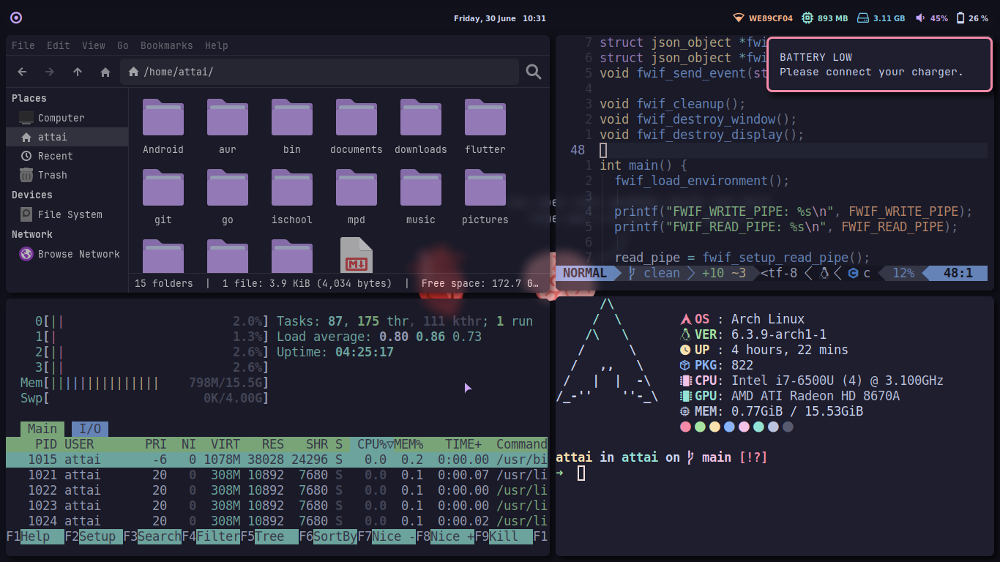

<h1 align="center">
    Dotfiles
</h1>

    A guide for setting up my desktop in case I "accidently" mess up real bad.

    

## Arch installation

[Video Guide](https://youtu.be/G-mLyrHonvU)

## Setting up the environment

See the [wiki](https://github.com/youssef-attai/dotfiles/wiki/).

## Quick overview

- **Shell:** zsh
- **Window manager:** i3
- **Editor:**: Neovim
- **Browser:**: Google Chrome
- **File manager:** Thunar
- **Compositor:** picom
- **Bar:** Polybar
- **Fonts:** JetBrains Mono + Nerd Fonts Symbols Only
