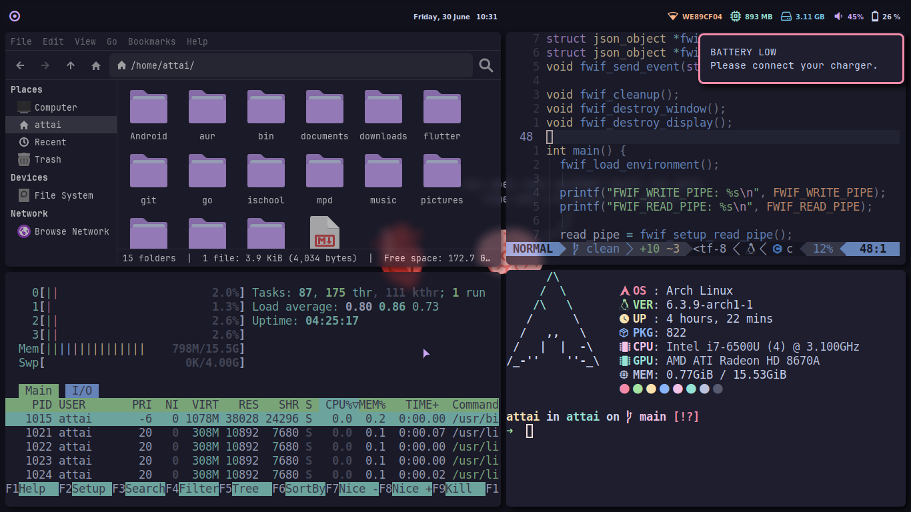

<h1 align="center">
    Dotfiles
</h1>

<p align="center">
    A guide for setting up my desktop in case I "accidently" mess up real bad.
</p>

<p align="center">
    
</p>

## Arch installation

[Video Guide](https://youtu.be/G-mLyrHonvU)

### Connecting to Wi-Fi

First of all, there won't be an internet connection.
So, to connect to a Wi-Fi network, use `iwd`:

```bash
iwctl
```

You will enter a REPL with a prompt `[iwd]#`

To list all network devices:

```bash
device list
```

To power on a device:

```bash
device <device> set-property Powered on
```

To power on the device's adapter:

```bash
adapter <adapter> set-property Powered on
```

To make the device scan for available Wi-Fi networks:

```bash
station <device> scan
```

To list available networks:

```bash
station <device> get-networks
```

To connect to a network:

```bash
station <device> connect <SSID>
```

If a passphrase is required, you will be prompted to enter it.
Alternatively, you can supply it as a command line argument:

```bash
iwctl --passphrase <passphrase> station <device> connect <SSID>
```

### Installing the `archinstall` script

You can now upgrade packages and install the archinstall script:

```bash
pacman -Syy
pacman -S archinstall 
```

If you get ModuleNotFoundError: no module named archinstall, do this:

```bash
pacman -Sy python archinstall 
```

### Faster Installation with `reflector`

Then, install reflector for building a faster mirrorlist:

```bash
pacman -S reflector 
```

Make backup of the current mirrorlist, and then run reflector:

```bash
cp /etc/pacman.d/mirrorlist /etc/pacman.d/mirrorlist.bkp
reflector --latest 100 --sort rate --save /etc/pacman.d/mirrorlist
```

### Installing Arch

You can now run archinstall:

```bash
archinstall
```

###### NOTE: if you have SD card inserted, remove it to avoid getting a weird orange warning

Go through the options normally until you reach the partitioning section.

### Partitioning

Create 3 partitions:

1. Boot partition

type is fat32
start at 3iMB
ends at 203MiB
mountpoint = /boot [via menu option: `assign mount point for a partition`]
boot = True [via menu option: `Mark/unmark a partition as bootable`]
Wipe = True [via menu option: `Mark/unmark a partition to be formatted`]
Repeat the above steps for the root partition.

2. Root partition

type is ext4
start at 206MiB
ends: 100GB
mountpoint = / [via menu option: `assign mount point for a partition`]
Wipe = True [via menu option: `Mark/unmark a partition to be formatted`]

3. Home partition

type is ext4
start at 100GB
ends: 100%
mountpoint = /home [via menu option: `assign mount point for a partition`]
Wipe = True [via menu option: `Mark/unmark a partition to be formatted`]

## Setting up the environment

See the [wiki](https://github.com/youssef-attai/dotfiles/wiki/).

## Quick overview

- **Shell:** zsh
- **Window manager:** i3
- **Editor:**: Neovim
- **Browser:**: Google Chrome
- **File manager:** Thunar
- **Compositor:** picom
- **Bar:** Polybar
- **Fonts:** JetBrains Mono + Nerd Fonts Symbols Only
